# Streaming Function Calls - Mermaid Diagrams

## Overall System Flow

## Streaming Event Sequence

## Function Call Accumulation State Machine

## Parallel Tool Execution Flow

```mermaid
graph TD
    subgraph Detection["Function Call Detection"]
        FC1[Function 1: search]
        FC2[Function 2: calculate]
        FC3[Function 3: read_file]
    end
    
    subgraph Execution["Parallel Execution"]
        P1[Process 1]
        P2[Process 2]
        P3[Process 3]
    end
    
    subgraph Tools["Tool Execution"]
        T1[HTTP API Call<br/>200ms]
        T2[Local Calculation<br/>5ms]
        T3[File I/O<br/>15ms]
    end
    
    subgraph Results["Results Collection"]
        R1[Weather: 72°F]
        R2[Result: $12.75]
        R3[Content: Hello]
    end
    
    FC1 --> P1
    FC2 --> P2
    FC3 --> P3
    
    P1 --> T1
    P2 --> T2
    P3 --> T3
    
    T1 --> R1
    T2 --> R2
    T3 --> R3
    
    R1 --> Collector[Results Collector]
    R2 --> Collector
    R3 --> Collector
    
    Collector --> Continue[Continue Streaming]
    
    style Detection fill:#3a3a3a,stroke:#00ff88
    style Execution fill:#2a3a2a,stroke:#ffaa00
    style Tools fill:#3a2a3a,stroke:#00aaff
    style Results fill:#3a3a2a,stroke:#00ff88
```

## Error Handling Flow

## Data Flow Through Components

## WebSocket Integration Example

## Performance Timeline

## Architecture Layers

