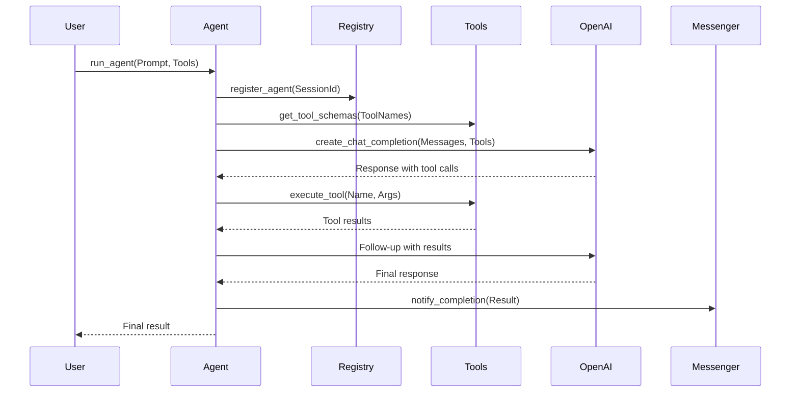

# MyApp - Advanced Erlang Agent System

A sophisticated, distributed agent framework built on Erlang/OTP principles, providing autonomous agents with tool-calling capabilities, inter-agent communication, and integration with OpenAI's API.

## Table of Contents

- [Overview](#overview)
- [Architecture](#architecture)
- [Features](#features)
- [Installation](#installation)
- [Quick Start](#quick-start)
- [Core Components](#core-components)
- [API Reference](#api-reference)
- [Examples](#examples)
- [Advanced Usage](#advanced-usage)
- [Configuration](#configuration)
- [Testing](#testing)
- [Performance Considerations](#performance-considerations)
- [Troubleshooting](#troubleshooting)
- [Contributing](#contributing)
- [License](#license)

## Overview

MyApp is a production-ready Erlang/OTP application that implements a distributed agent framework. It enables the creation of autonomous agents that can:

- Execute tasks independently using AI-powered decision making
- Communicate with other agents through a message-passing protocol
- Utilize configurable tools for extending functionality
- Maintain state and handle failures gracefully
- Scale horizontally across distributed Erlang nodes

### Key Design Principles

1. **Fault Tolerance**: Built on OTP supervision trees for automatic recovery
2. **Scalability**: Distributed architecture supporting multi-node deployments
3. **Extensibility**: Plugin-based tool system for custom functionality
4. **Observability**: Comprehensive logging and monitoring capabilities
5. **Security**: Built-in authentication and authorization mechanisms

## Architecture

```
┌─────────────────────────────────────────────────────────────────┐
│                         MyApp Supervisor                         │
├─────────────────────────────────────────────────────────────────┤
│                                                                 │
│  ┌─────────────┐  ┌──────────────┐  ┌────────────────┐       │
│  │    Agent    │  │    Agent     │  │     Agent      │       │
│  │ Supervisor  │  │  Registry    │  │   Discovery    │       │
│  └──────┬──────┘  └──────────────┘  └────────────────┘       │
│         │                                                       │
│  ┌──────┴───────────────────────┐                             │
│  │        Agent Processes        │                             │
│  │  ┌────────┐ ┌────────┐      │                             │
│  │  │Agent 1 │ │Agent 2 │ ...  │                             │
│  │  └────────┘ └────────┘      │                             │
│  └──────────────────────────────┘                             │
│                                                                 │
│  ┌──────────────┐  ┌──────────────┐  ┌──────────────┐       │
│  │    Agent     │  │   Agent      │  │   Agent      │       │
│  │   Messenger  │  │   Tools      │  │  Protocol    │       │
│  └──────────────┘  └──────────────┘  └──────────────┘       │
└─────────────────────────────────────────────────────────────────┘
```

### Component Interaction Flow



## Features

### Core Features

- **Autonomous Agents**: Self-directed agents that make decisions based on prompts and available tools
- **Tool System**: Extensible framework for adding custom tools and capabilities
- **Inter-Agent Communication**: Message-passing system for agent collaboration
- **Service Discovery**: Automatic agent discovery and capability-based routing
- **Fault Tolerance**: Supervisor-based architecture with automatic recovery
- **Distributed Operation**: Support for multi-node Erlang clusters

### Advanced Features

- **Dynamic Tool Registration**: Add and remove tools at runtime
- **Agent Lifecycle Management**: Complete control over agent creation, monitoring, and termination
- **Message History**: Built-in message tracking for debugging and auditing
- **Capability-Based Routing**: Route requests to agents based on their capabilities
- **Health Monitoring**: Automatic health checks and stale agent cleanup
- **OpenAI Integration**: Seamless integration with OpenAI's GPT models

## Installation

### Prerequisites

- Erlang/OTP 24.0 or higher
- Rebar3 build tool
- OpenAI API key (for AI-powered features)

### Building from Source

```bash
# Clone the repository
git clone <repository-url>
cd myapp

# Fetch dependencies
rebar3 get-deps

# Compile the application
rebar3 compile

# Run tests
rebar3 eunit

# Create a release
rebar3 release
```

### Configuration

Create a `config/sys.config` file:

```erlang
[
    {myapp, [
        {openai_api_key, <<"your-api-key-here">>},
        {default_model, <<"gpt-4-mini">>},
        {agent_timeout, 60000},
        {max_agents, 100}
    ]},
    {openai, [
        {api_key, <<"your-api-key-here">>},
        {base_url, <<"https://api.openai.com/v1">>},
        {timeout, 30000}
    ]}
].
```

## Quick Start

### Starting the Application

```erlang
% Start the application
application:ensure_all_started(myapp).

% Create a simple agent
{ok, Response} = agent:run_agent(
    <<"What is the weather in San Francisco?">>,
    [weather_tool]
).

% Register a custom tool
agent:define_tool(calculator, #{
    type => function,
    function => #{
        name => <<"calculator">>,
        description => <<"Performs mathematical calculations">>,
        parameters => #{
            type => object,
            properties => #{
                expression => #{
                    type => string,
                    description => <<"Mathematical expression to evaluate">>
                }
            },
            required => [<<"expression">>]
        }
    }
}).

% Register tool executor
agent:execute_tool(calculator, 
    fun(#{<<"expression">> := Expr}) ->
        % Implement calculation logic
        {ok, evaluate_expression(Expr)}
    end,
    #{}
).
```

### Creating Custom Agents

```erlang
% Define a custom agent module
-module(my_custom_agent).
-behaviour(gen_server).

% Implement the simple_agent behaviour
create() ->
    simple_agent:create(#{
        name => <<"CustomAgent">>,
        prompt => <<"You are a helpful assistant">>,
        tools => [calculator, weather_tool],
        options => #{
            model => <<"gpt-4">>,
            temperature => 0.7
        }
    }).
```

## Core Components

### 1. Agent Module (`agent.erl`)

The main entry point for creating and managing agents.

**Key Functions:**
- `start/0` - Start the agent application
- `run_agent/2,3` - Run an agent with a prompt and tools
- `define_tool/2` - Define a new tool schema
- `execute_tool/3` - Register a tool executor

**Example:**
```erlang
% Run an agent with multiple tools
Result = agent:run_agent(
    <<"Create a report about current weather trends">>,
    [weather_tool, file_writer, data_analyzer],
    #{
        model => <<"gpt-4">>,
        timeout => 120000,
        system_message => <<"You are a weather analyst">>
    }
).
```

### 2. Agent Registry (`agent_registry.erl`)

Manages agent lifecycle and provides lookup services.

**Key Functions:**
- `register_agent/2` - Register a new agent
- `unregister_agent/1` - Remove an agent
- `get_agent/1` - Retrieve agent information
- `list_agents/0` - List all active agents

**Example:**
```erlang
% Register an agent
ok = agent_registry:register_agent(my_agent_id, self()).

% List all agents
{ok, Agents} = agent_registry:list_agents().

% Get specific agent info
{ok, Info} = agent_registry:get_agent(my_agent_id).
```

### 3. Agent Discovery (`agent_discovery.erl`)

Provides service discovery and capability-based agent lookup.

**Key Functions:**
- `register_agent/3` - Register with capabilities
- `find_by_capability/1` - Find agents by capability
- `update_agent_capabilities/2` - Update capabilities

**Example:**
```erlang
% Register an agent with capabilities
agent_discovery:register_agent(
    weather_agent,
    self(),
    #{
        weather_data => true,
        temperature => true,
        forecast => true
    }
).

% Find agents that can provide weather data
{ok, WeatherAgents} = agent_discovery:find_by_capability(weather_data).
```

### 4. Agent Messenger (`agent_messenger.erl`)

Handles inter-agent communication.

**Key Functions:**
- `send_message/3` - Send message to specific agent
- `send_broadcast/2` - Broadcast to all agents
- `register_handler/2` - Register message handler

**Example:**
```erlang
% Register a message handler
agent_messenger:register_handler(my_agent, 
    fun(Message, _Options) ->
        io:format("Received: ~p~n", [Message]),
        {ok, processed}
    end
).

% Send a message
{ok, Reply} = agent_messenger:send_message(
    target_agent,
    #{type => request, data => <<"Hello">>},
    #{timeout => 5000}
).
```

### 5. Agent Tools (`agent_tools.erl`)

Manages tool definitions and executions.

**Key Functions:**
- `register_tool/2` - Register tool schema
- `register_executor/3` - Register tool executor
- `execute_tool/2` - Execute a tool
- `list_tools/0` - List available tools

**Example:**
```erlang
% Register a file reader tool
agent_tools:register_tool(file_reader, #{
    type => function,
    function => #{
        name => <<"file_reader">>,
        description => <<"Reads contents of a file">>,
        parameters => #{
            type => object,
            properties => #{
                path => #{
                    type => string,
                    description => <<"File path to read">>
                }
            },
            required => [<<"path">>]
        }
    }
}).

% Register the executor
agent_tools:register_executor(file_reader,
    fun(#{<<"path">> := Path}) ->
        case file:read_file(Path) of
            {ok, Content} -> {ok, Content};
            {error, Reason} -> {error, Reason}
        end
    end,
    #{}
).
```

### 6. Agent Protocol (`agent_protocol.erl`)

Defines communication protocols and message formats.

**Key Functions:**
- `encode_message/1` - Encode messages
- `decode_message/1` - Decode messages
- `validate_message/1` - Validate message format

### 7. UUID Module (`uuid.erl`)

Generates unique identifiers for agents and sessions.

**Key Functions:**
- `v4/0` - Generate UUID v4
- `to_string/1` - Convert UUID to string

## API Reference

### Agent API

```erlang
%% Start an agent with default options
-spec run_agent(Prompt :: binary(), ToolNames :: [atom()]) -> 
    {ok, Response :: binary()} | {error, Reason :: term()}.

%% Start an agent with custom options
-spec run_agent(Prompt :: binary(), ToolNames :: [atom()], Options :: map()) -> 
    {ok, Response :: binary()} | {error, Reason :: term()}.

%% Options include:
%% - model: OpenAI model to use (default: <<"gpt-4-mini">>)
%% - timeout: Request timeout in ms (default: 60000)
%% - system_message: System prompt (default: <<"Erlang agent assistant">>)
%% - temperature: Model temperature (0.0-2.0)
%% - max_tokens: Maximum response tokens
```

### Tool API

```erlang
%% Define a tool schema
-spec define_tool(Name :: atom(), Schema :: map()) -> ok | {error, term()}.

%% Register a tool executor
-spec execute_tool(Name :: atom(), 
                  ExecutorFn :: function(), 
                  Options :: map()) -> ok | {error, term()}.

%% Tool schema format:
%% #{
%%     type => function,
%%     function => #{
%%         name => binary(),
%%         description => binary(),
%%         parameters => #{
%%             type => object,
%%             properties => map(),
%%             required => [binary()]
%%         }
%%     }
%% }
```

### Discovery API

```erlang
%% Register agent with capabilities
-spec register_agent(AgentId :: term(), 
                    Pid :: pid(), 
                    Capabilities :: map()) -> ok | {error, term()}.

%% Find agents by capability
-spec find_by_capability(Capability :: term()) -> 
    {ok, [AgentInfo :: map()]} | {error, term()}.

%% AgentInfo format:
%% #{
%%     id => term(),
%%     pid => pid(),
%%     capabilities => map(),
%%     status => atom(),
%%     last_seen => timestamp()
%% }
```

## Examples

### Example 1: Weather Assistant

```erlang
% Define weather tool
agent:define_tool(weather, #{
    type => function,
    function => #{
        name => <<"get_weather">>,
        description => <<"Get current weather for a location">>,
        parameters => #{
            type => object,
            properties => #{
                location => #{
                    type => string,
                    description => <<"City name or coordinates">>
                },
                units => #{
                    type => string,
                    enum => [<<"celsius">>, <<"fahrenheit">>],
                    description => <<"Temperature units">>
                }
            },
            required => [<<"location">>]
        }
    }
}).

% Implement weather fetcher
agent:execute_tool(weather,
    fun(#{<<"location">> := Location} = Args) ->
        Units = maps:get(<<"units">>, Args, <<"celsius">>),
        % Call weather API
        Weather = fetch_weather_data(Location, Units),
        {ok, Weather}
    end,
    #{}
).

% Use the weather assistant
{ok, Response} = agent:run_agent(
    <<"What's the weather like in Tokyo and New York? Compare them.">>,
    [weather],
    #{model => <<"gpt-4">>}
).
```

### Example 2: Multi-Agent Collaboration

```erlang
% Create a research agent
ResearchAgent = spawn(fun() ->
    simple_agent:create(#{
        name => <<"Researcher">>,
        tools => [web_search, summarizer],
        prompt => <<"You research topics thoroughly">>
    })
end).

% Create a writer agent  
WriterAgent = spawn(fun() ->
    simple_agent:create(#{
        name => <<"Writer">>,
        tools => [text_formatter, grammar_checker],
        prompt => <<"You write clear, engaging content">>
    })
end).

% Register agents
agent_discovery:register_agent(researcher, ResearchAgent, #{research => true}),
agent_discovery:register_agent(writer, WriterAgent, #{writing => true}).

% Collaborate on a task
agent_messenger:send_message(researcher,
    #{task => <<"Research quantum computing basics">>},
    #{}
).

% Writer gets research results
agent_messenger:register_handler(writer,
    fun(#{type := research_complete, data := Data}, _) ->
        % Process research and write article
        Article = write_article(Data),
        {ok, Article}
    end
).
```

### Example 3: Tool Composition

```erlang
% Create composite tools
-module(composite_tools).
-export([init/0]).

init() ->
    % Data fetcher tool
    agent:define_tool(fetch_data, #{
        type => function,
        function => #{
            name => <<"fetch_data">>,
            description => <<"Fetches data from various sources">>,
            parameters => #{
                type => object,
                properties => #{
                    source => #{type => string},
                    query => #{type => string}
                },
                required => [<<"source">>, <<"query">>]
            }
        }
    }),
    
    % Data analyzer tool
    agent:define_tool(analyze_data, #{
        type => function,
        function => #{
            name => <<"analyze_data">>,
            description => <<"Analyzes data and provides insights">>,
            parameters => #{
                type => object,
                properties => #{
                    data => #{type => string},
                    analysis_type => #{type => string}
                },
                required => [<<"data">>, <<"analysis_type">>]
            }
        }
    }),
    
    % Report generator tool
    agent:define_tool(generate_report, #{
        type => function,
        function => #{
            name => <<"generate_report">>,
            description => <<"Generates formatted reports">>,
            parameters => #{
                type => object,
                properties => #{
                    analysis => #{type => string},
                    format => #{type => string}
                },
                required => [<<"analysis">>, <<"format">>]
            }
        }
    }).

% Use composite tools
{ok, Report} = agent:run_agent(
    <<"Analyze sales data for Q4 and create an executive summary">>,
    [fetch_data, analyze_data, generate_report],
    #{
        model => <<"gpt-4">>,
        system_message => <<"You are a data analyst assistant">>
    }
).
```

## Advanced Usage

### Distributed Agents

```erlang
% Start nodes
% Node 1: erl -name agent1@host1 -setcookie secret
% Node 2: erl -name agent2@host2 -setcookie secret

% Connect nodes
net_adm:ping('agent2@host2').

% Start application on both nodes
application:ensure_all_started(myapp).

% Agents can now discover each other across nodes
{ok, RemoteAgents} = agent_discovery:find_all().
```

### Custom Supervision Trees

```erlang
-module(my_agent_supervisor).
-behaviour(supervisor).

init([]) ->
    SupFlags = #{
        strategy => one_for_one,
        intensity => 5,
        period => 60
    },
    
    Children = [
        #{
            id => agent_pool,
            start => {agent_pool, start_link, [10]}, % 10 agents
            restart => permanent,
            type => supervisor
        },
        #{
            id => monitoring_agent,
            start => {monitoring_agent, start_link, []},
            restart => permanent,
            type => worker
        }
    ],
    
    {ok, {SupFlags, Children}}.
```

### Performance Tuning

```erlang
% Configure agent pool
application:set_env(myapp, agent_pool_config, #{
    min_size => 5,
    max_size => 50,
    overflow => 10
}).

% Configure timeouts
application:set_env(myapp, timeouts, #{
    agent_timeout => 120000,      % 2 minutes
    tool_timeout => 30000,        % 30 seconds
    message_timeout => 5000       % 5 seconds
}).

% Configure rate limiting
application:set_env(openai, rate_limits, #{
    requests_per_minute => 60,
    tokens_per_minute => 150000
}).
```

## Configuration

### Application Configuration

Configuration is managed through `sys.config`:

```erlang
[
    {myapp, [
        %% Agent configuration
        {default_model, <<"gpt-4-mini">>},
        {agent_timeout, 60000},
        {max_agents, 100},
        {agent_cleanup_interval, 300000}, % 5 minutes
        
        %% Tool configuration
        {tool_timeout, 30000},
        {max_tool_retries, 3},
        
        %% Discovery configuration
        {heartbeat_interval, 30000},
        {stale_agent_threshold, 600000}, % 10 minutes
        
        %% Messenger configuration
        {max_message_history, 1000},
        {message_timeout, 5000}
    ]},
    
    {openai, [
        {api_key, <<"your-api-key">>},
        {base_url, <<"https://api.openai.com/v1">>},
        {timeout, 30000},
        {max_retries, 3},
        {retry_delay, 1000}
    ]},
    
    {kernel, [
        {logger_level, info},
        {logger, [
            {handler, default, logger_std_h, #{
                config => #{
                    file => "logs/myapp.log",
                    filesync_repeat_interval => 5000,
                    file_check => 5000,
                    max_no_bytes => 10485760, % 10 MB
                    max_no_files => 5
                }
            }}
        ]}
    ]}
].
```

### Environment Variables

The application supports environment variable configuration:

```bash
# OpenAI configuration
export OPENAI_API_KEY="sk-..."
export OPENAI_BASE_URL="https://api.openai.com/v1"
export OPENAI_MODEL="gpt-4"

# Agent configuration
export MYAPP_MAX_AGENTS="200"
export MYAPP_AGENT_TIMEOUT="120000"

# Start the application
_build/default/rel/myapp/bin/myapp start
```

## Testing

### Unit Tests

```erlang
% Run all tests
rebar3 eunit

% Run specific test module
rebar3 eunit --module=agent_tests

% Run with coverage
rebar3 cover --verbose
```

### Integration Tests

```erlang
% Test agent creation and execution
-module(agent_integration_tests).
-include_lib("eunit/include/eunit.hrl").

agent_lifecycle_test() ->
    % Start application
    {ok, _} = application:ensure_all_started(myapp),
    
    % Define test tool
    agent:define_tool(test_tool, #{
        type => function,
        function => #{
            name => <<"test">>,
            description => <<"Test tool">>,
            parameters => #{}
        }
    }),
    
    % Register executor
    agent:execute_tool(test_tool, 
        fun(_) -> {ok, <<"test_result">>} end, 
        #{}
    ),
    
    % Run agent
    {ok, Result} = agent:run_agent(
        <<"Use the test tool">>, 
        [test_tool]
    ),
    
    ?assertMatch(<<_/binary>>, Result).
```

### Load Testing

```erlang
% Simple load test
-module(load_test).
-export([run/2]).

run(NumAgents, NumRequests) ->
    % Start agents
    Agents = [spawn_agent(I) || I <- lists:seq(1, NumAgents)],
    
    % Send requests
    Results = [send_request(A, R) || 
               A <- Agents, 
               R <- lists:seq(1, NumRequests)],
    
    % Analyze results
    analyze_results(Results).

spawn_agent(Id) ->
    spawn(fun() ->
        agent:run_agent(
            <<"Test prompt">>,
            [test_tool],
            #{timeout => 10000}
        )
    end).
```

## Performance Considerations

### Memory Management

- Agents are lightweight Erlang processes (~2KB initial heap)
- Tool results are garbage collected after use
- Message history is capped at configurable limit
- Stale agents are automatically cleaned up

### Scalability Guidelines

- **Vertical Scaling**: Increase Erlang scheduler threads
  ```bash
  erl +S 16 +SDcpu 8:8
  ```

- **Horizontal Scaling**: Distribute across nodes
  ```erlang
  % Configure distributed agent discovery
  application:set_env(myapp, discovery_nodes, [
      'agent@host1',
      'agent@host2',
      'agent@host3'
  ]).
  ```

### Optimization Tips

1. **Tool Design**
   - Keep tool operations atomic and fast
   - Use async tools for long-running operations
   - Cache frequently accessed data

2. **Agent Configuration**
   - Set appropriate timeouts based on workload
   - Use connection pooling for external services
   - Enable batch processing where possible

3. **Monitoring**
   - Use Erlang's observer for real-time monitoring
   - Set up metrics collection (Prometheus, etc.)
   - Monitor message queue lengths

## Troubleshooting

### Common Issues

#### Agent Timeout
```erlang
% Increase timeout for long-running operations
{ok, Result} = agent:run_agent(Prompt, Tools, #{
    timeout => 300000  % 5 minutes
}).
```

#### Tool Execution Failures
```erlang
% Add error handling to tool executors
agent:execute_tool(my_tool,
    fun(Args) ->
        try
            do_work(Args)
        catch
            Type:Reason:Stack ->
                logger:error("Tool failed: ~p:~p~n~p", 
                           [Type, Reason, Stack]),
                {error, {tool_failed, Reason}}
        end
    end,
    #{retry => true, max_retries => 3}
).
```

#### Memory Issues
```erlang
% Monitor memory usage
MemInfo = erlang:memory(),
logger:info("Memory usage: ~p", [MemInfo]).

% Force garbage collection
[erlang:garbage_collect(P) || P <- erlang:processes()].
```

### Debugging Tools

```erlang
% Enable debug logging
logger:set_primary_config(level, debug).

% Trace agent execution
dbg:tracer(),
dbg:p(all, c),
dbg:tpl(agent, run_agent, []).

% View agent registry state
sys:get_state(agent_registry).

% Monitor message flow
agent_messenger:register_handler(debug_monitor,
    fun(Msg, _) ->
        logger:debug("Message: ~p", [Msg]),
        {ok, monitored}
    end
).
```

### Health Checks

```erlang
% Check application health
-module(health_check).
-export([run/0]).

run() ->
    Checks = [
        check_application_running(),
        check_agent_registry(),
        check_openai_connection(),
        check_memory_usage()
    ],
    
    Results = [{Check, Result} || {Check, Result} <- Checks],
    {ok, Results}.

check_application_running() ->
    case application:get_application(myapp) of
        {ok, myapp} -> {app_running, ok};
        _ -> {app_running, error}
    end.
```

## Contributing

### Development Setup

1. Fork the repository
2. Create a feature branch
3. Make your changes
4. Add tests for new functionality
5. Ensure all tests pass
6. Submit a pull request

### Code Style

- Follow Erlang coding conventions
- Use meaningful variable and function names
- Add type specs for public functions
- Document complex logic with comments
- Keep functions small and focused

### Testing Requirements

- Unit tests for all new functions
- Integration tests for new features
- Property-based tests where applicable
- Performance benchmarks for critical paths

## License

This project is licensed under the Apache License 2.0. See the LICENSE file for details.

## Acknowledgments

- Built on Erlang/OTP for reliability and scalability
- Integrates with OpenAI for AI capabilities
- Inspired by actor model and agent-based systems
- Community contributions and feedback

## Support

For support, please:
1. Check the documentation
2. Search existing issues
3. Create a new issue with:
   - Erlang/OTP version
   - Error messages and stack traces
   - Minimal reproducible example
   - Expected vs actual behavior

---

For more examples and tutorials, visit the [examples directory](./examples/) or check out our [wiki](https://github.com/your-repo/wiki).